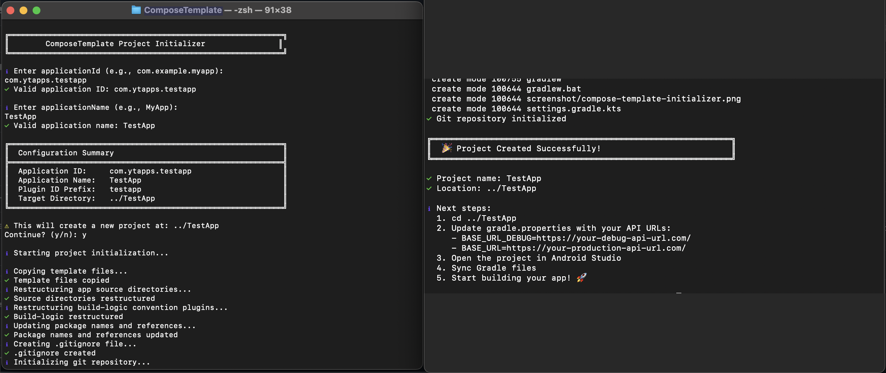

<br/>
<p align="center">
  <h3 align="center">ComposeTemplate</h3>

  <p align="center">
    ComposeTemplate is a Jetpack Compose template application that follows Clean Architecture and modularization best practices. It simplifies the process of setting up a well-structured Compose application by providing a template with a predefined folder structure. ✨
    <br/>
    <br/>
    <a href="https://github.com/mustafayigitt/ComposeTemplate/issues">Report Bug</a>
    <a href="https://github.com/mustafayigitt/ComposeTemplate/issues">Request Feature</a>
  </p>
</p>


 


## About The Project



ComposeTemplate is a Jetpack Compose template application that follows Clean Architecture and modularization best practices. It simplifies the process of setting up a well-structured Compose application by providing a template with a predefined folder structure. ✨

## Built With

* [Kotlin](https://github.com/JetBrains/kotlin) - Modern programming language for Android
* [Modern Architecture](https://developer.android.com/topic/architecture) - UDF Architecture pattern
* [Jetpack Compose](https://developer.android.com/jetpack/compose) - Modern UI toolkit
* [Material 3](https://m3.material.io/) - Material Design 3 components
* [Navigation3](https://developer.android.com/jetpack/androidx/releases/navigation) - Type-safe navigation library
* [Retrofit](https://github.com/square/retrofit) - HTTP client for Android
* [Gson](https://github.com/google/gson) - JSON serialization/deserialization
* [Hilt](https://developer.android.com/training/dependency-injection/hilt-android) - Dependency injection framework
* [Kotlin Coroutines](https://kotlinlang.org/docs/coroutines-overview.html) - Asynchronous programming
* [Kotlin Serialization](https://kotlinlang.org/docs/serialization.html) - Type-safe serialization
* [jUnit](https://developer.android.com/training/testing/local-tests) - Unit testing framework
* [MockK](https://github.com/mockk/mockk) - Mocking library for Kotlin
* [Truth](https://github.com/google/truth) - Fluent assertions for Java and Android

## Project Structure

The project follows Clean Architecture principles with clear separation of concerns and uses Convention Plugins for build configuration. The project is also modularized by feature.

```
ComposeTemplate/
├── app/                # Main application module
├── core/               # Core module with shared utilities
│   ├── data/           # Data storage implementations
│   ├── network/        # Network layer utilities
│   └── preferences/    # Shared preferences utilities
├── contract/           # Shared navigation routes and contracts
├── feature/
│   ├── example/           # Example feature module
│   │   ├── data/       # Data layer (repositories, API services)
│   │   ├── domain/     # Domain layer (use cases, business logic)
│   │   ├── navigation/ # Navigation layer (routes, navigation logic)
│   │   └── presentation/ # Presentation layer (UI, ViewModels)
│   ├──...
├── build-logic/                        # Build configuration
│   ├── convention/                     # Convention plugins
│   │   └── src/main/kotlin/com/ytapps/composetemplate/convention/
│   │       ├── AndroidApplicationConventionPlugin.kt
│   │       ├── AndroidComposeConventionPlugin.kt
│   │       ├── AndroidHiltConventionPlugin.kt
│   │       ├── AndroidLibraryConventionPlugin.kt
│   │       ├── FeatureConventionPlugin.kt
│   │       ├── TestConventionPlugin.kt
│   │       ├── KotlinAndroid.kt
│   │       └── ProjectExtensions.kt
│   └── README.md                       # Build logic documentation
└── gradle/
    └── libs.versions.toml # Version catalog

## Configuration Files

├── gradle.properties     # Gradle configuration and API URLs
├── local.properties      # Local development properties (gitignored)
├── .gitignore           # Git ignore rules
├── initializer.sh       # Project initialization script
└── settings.gradle.kts  # Gradle settings
```

## Build Configuration

This project uses modern Gradle build configuration with **Convention Plugins** and **Version Catalog** for maintainable and scalable build logic.

### Convention Plugins

Located in `build-logic/convention/`, these plugins encapsulate common build configuration:

- **`composetemplate.android.application`**: Base Android app configuration (SDK versions, Kotlin setup)
- **`composetemplate.android.application.compose`**: Jetpack Compose setup with common dependencies
- **`composetemplate.android.hilt`**: Hilt dependency injection configuration
- **`composetemplate.android.library`**: Android library module configuration
- **`composetemplate.test`**: Common testing dependencies (JUnit, Truth, MockK, Espresso)
- **`composetemplate.feature`**: Base dependencies for feature modules (:core, :contract)

Benefits:
- ✅ Centralized build configuration
- ✅ Reduced duplication across modules (60+ lines eliminated)
- ✅ Type-safe Kotlin DSL
- ✅ Easy to maintain and update
- ✅ Consistent testing setup across all modules

### Version Catalog

All dependencies and versions are managed in `gradle/libs.versions.toml`:

```toml
[versions]
minSdk = "23"
compileSdk = "36"
targetSdk = "36"
versionCode = "1"
versionName = "1.0.0"
kotlin = "2.2.10"

[libraries]
androidx-core = { module = "androidx.core:core-ktx", version.ref = "androidx-core" }
```

Benefits:
- ✅ Single source of truth for versions
- ✅ Type-safe dependency accessors
- ✅ Easy version updates
- ✅ Shared across all modules

For detailed build configuration documentation, see [build-logic/README.md](build-logic/README.md).

## Key Features

### Navigation System
- **Navigation3 Integration**: Uses the latest Navigation3 library with type-safe navigation
- **Custom NavigationManager**: Flexible navigation management with back stack handling
- **Bottom Navigation Bar**: Material 3 adaptive bottom navigation bar
- **Route-based Navigation**: Serializable route objects for type-safe navigation
- **Navigation Methods**: 
  - `navigate()` - Navigate to a new screen
  - `navigateBack()` - Navigate back in the stack
  - `navigateOver()` - Navigate over a specific route
  - `navigateToTop()` - Navigate to top of stack
  - `selectTab()` - Select bottom bar tab

### Screens Included
- **Splash Screen**: Initial screen with routing logic
- **Login Screen**: Authentication screen with login flow
- **Home Screen**: Main home screen with navigation examples
- **Search Screen**: Search functionality screen
- **Profile Screen**: User profile screen
- **List Screen**: List view example
- **Detail Screen**: Detail view example

### Network Layer
- **Retrofit Integration**: Configured with Gson converter
- **DefaultInterceptor**: Automatic token injection and refresh token handling
  - Adds Authorization header to all requests
  - Handles 401 Unauthorized responses
  - Automatic token refresh on authentication failure
- **BaseRepository**: Safe API call wrapper with error handling
  - `safeCall()` function for error-safe network calls
  - Returns `Result<T>` sealed class (Success/Error)

### Data Management
- **PreferencesManager**: Local data storage using SharedPreferences
  - Token management (access token, token type)
  - User credentials storage
  - User session management
- **Repository Pattern**: Clean separation between data sources
- **Mapper Pattern**: Data model transformation between layers

### Dependency Injection
- **Hilt Integration**: Full dependency injection setup
- **ProviderModule**: Provides network components (Retrofit, OkHttp, Gson)
- **BinderModule**: Binds interfaces to implementations
- **Singleton Components**: Properly scoped dependencies

### Testing
- **Unit Tests**: Comprehensive test coverage with JUnit
- **MockK**: Mocking framework for Kotlin
- **Truth**: Fluent assertions library
- **Test Examples**: 
  - Repository tests
  - ViewModel tests
  - Mapper tests
  - Use case tests
  - Base repository tests

### UI/UX
- **Material 3 Design**: Latest Material Design components
- **Custom Theme**: Themed colors and typography
- **Adaptive Navigation**: Material 3 adaptive navigation components
- **Compose UI**: Fully built with Jetpack Compose

## Predefined Structures

- **Header and Refresh Token Interceptor**: Automatic token management with refresh token support
- **Safe Network Calls**: Error-handled network function
- **Flexible Navigation Structure**: Custom navigation manager with Navigation3
- **Preferences Manager**: Local data storage with SharedPreferences
- **Auth Flow**: Complete authentication flow with token management
- **Clean Architecture**: Complete separation of Data, Domain, and Presentation layers
- **Unit Tests**: All structures tested with JUnit and MockK
- **End-to-End Examples**: Complete examples for all architecture layers

## Getting Started

### Prerequisites

- Android Studio Hedgehog (2023.1.1) or later
- JDK 17 or later
- Android SDK with API level 23 (Android 6.0) or higher
- Gradle 8.13.0 or later

### Installation

1. **Clone the repository**

```sh
git clone https://github.com/mustafayigitt/ComposeTemplate.git
cd ComposeTemplate
```

2. **Configure Base URLs**

Create or update `gradle.properties` in the project root with your API base URLs:

```properties
BASE_URL_DEBUG=https://your-debug-api-url.com/
BASE_URL=https://your-production-api-url.com/
```

3. **Run the Initializer Script**

To create a new project using this template:

```sh
chmod +x initializer.sh
./initializer.sh
```

The script provides an interactive setup with:
- **Input Validation**: Ensures valid application ID and name formats
- **Configuration Summary**: Shows all settings before proceeding
- **Confirmation Prompt**: Asks for confirmation before creating the project

When prompted:
- Enter your `applicationId` (e.g., `com.example.myapp`)
  - Must be lowercase with at least 2 segments (e.g., `com.example`)
  - Only letters, numbers, and underscores allowed
- Enter your `applicationName` (e.g., `MyApp`)
  - Must start with a letter
  - Only alphanumeric characters allowed

The script will:
- ✅ Validate your inputs
- ✅ Create a new project directory with your application name
- ✅ Restructure all source directories (app + build-logic)
- ✅ Replace all package names and references
- ✅ Update convention plugin package names and IDs
- ✅ Generate a proper `.gitignore` file
- ✅ Initialize a new git repository with an initial commit
- ✅ Clean up template-specific files
- ✅ Provide clear next steps

4. **Open the Project**

Open the newly created project in Android Studio:
- If using the template directly: Open `ComposeTemplate` folder
- If using initializer: Open the created project folder (e.g., `../MyApp`)

5. **Sync and Build**

- Sync Gradle files
- Build the project (Build > Make Project)
- Run on an emulator or device

### Configuration

#### Build Configuration

The project uses build variants for different environments:
- **Debug**: Uses `BASE_URL_DEBUG` from `gradle.properties`
- **Release**: Uses `BASE_URL` from `gradle.properties`

#### Minimum Requirements

- **minSdk**: 23 (Android 6.0)
- **targetSdk**: 36
- **compileSdk**: 36
- **Java Version**: 17
- **Kotlin Version**: 2.2.10

#### Dependencies

All dependencies are managed through `gradle/libs.versions.toml` using Version Catalogs. Key dependencies include:

- Compose BOM: 2024.06.00
- Hilt: 2.57.1
- Retrofit: 2.11.0
- Navigation3: 1.0.0
- Kotlin: 2.2.10
- Kotlin Serialization: 2.1.21
- Kotlin Coroutines: 1.7.3

## Usage Examples

### Creating a New Feature

1. **Create Route Object** (in `feature/yourfeature/navigation/YourFeatureRoute.kt`):

```kotlin
@Serializable
data object YourFeatureRoute : INavigationItem {
    override val route: String = "route_your_feature"
}
```

2. **Create Screen Provider** (in `feature/yourfeature/presentation/YourFeatureScreenProvider.kt`):

```kotlin
class YourFeatureScreenProvider @Inject constructor() : IScreenProvider {
    @Composable
    override fun provideScreen(
        route: INavigationItem,
        navigationManager: INavigationManager
    ): Boolean {
        return when (route) {
            is YourFeatureRoute -> {
                YourFeatureScreen(navigationManager)
                true
            }
            else -> false
        }
    }
}
```

3. **Create Screen Composable** (in `feature/yourfeature/presentation/YourFeatureScreen.kt`):

```kotlin
@Composable
fun YourFeatureScreen(
    navigationManager: INavigationManager,
) {
    // Your UI implementation
}
```

4. **Register Screen Provider** in your DI module.

### Making API Calls

1. **Create API Service** (in `feature/yourfeature/data/remote/YourService.kt`):

```kotlin
interface YourService {
    @POST("your-endpoint")
    suspend fun yourMethod(@Body request: YourRequestModel): Response<YourResponseModel>
}
```

2. **Create Repository** (in `feature/yourfeature/data/repository/YourRepository.kt`):

```kotlin
class YourRepository @Inject constructor(
    private val yourService: YourService
) : BaseRepository(), IYourRepository {
    override suspend fun yourMethod(): Result<YourResponseModel> {
        return safeCall {
            yourService.yourMethod(YourRequestModel())
        }
    }
}
```

3. **Use in ViewModel**:

```kotlin
@HiltViewModel
class YourViewModel @Inject constructor(
    private val repository: IYourRepository
) : ViewModel() {
    fun loadData() {
        viewModelScope.launch {
            when (val result = repository.yourMethod()) {
                is Result.Success -> {
                    // Handle success
                }
                is Result.Error -> {
                    // Handle error
                }
            }
        }
    }
}
```

### Navigation Examples

```kotlin
// Navigate to a new screen
navigationManager.navigate(YourFeature)

// Navigate back
navigationManager.navigateBack()

// Navigate over a specific route
navigationManager.navigateOver(NewRoute, OldRoute)

// Navigate to top of stack
navigationManager.navigateToTop(Home)
```

### Storing Data Locally

```kotlin
// In your repository or use case
@Inject constructor(
    private val prefs: IPreferencesManager
) {
    // Save data
    prefs.saveString("key", "value")
    
    // Get data
    val value = prefs.getString("key", "default")
    
    // Save credentials (for auth)
    prefs.saveCredentials(authResponse)
}
```

## Architecture

This project follows **Clean Architecture** principles with three main layers:

### Data Layer
- **Responsibility**: Data sources (remote API, local storage)
- **Components**: Repositories, Data Models, API Services, Local Storage
- **Location**: `feature/*/data/` package

### Domain Layer
- **Responsibility**: Business logic and use cases
- **Components**: Use Cases, Domain Models, Repository Interfaces, Mappers
- **Location**: `feature/*/domain/` package

### Presentation Layer
- **Responsibility**: UI and user interactions
- **Components**: ViewModels, UI States, Composable Screens, Routes
- **Location**: `feature/*/presentation/` package

### Contract Layer
- **Responsibility**: Shared navigation routes and UI contracts
- **Components**: Main route definitions, Bottom bar item definitions, Navigation contracts
- **Location**: `contract/` package

### Core Layer
- **Responsibility**: Shared utilities and base classes
- **Components**: Base classes, Navigation, DI modules, Theme, API utilities
- **Location**: `core/` package

## Testing

The project includes comprehensive unit tests. Run tests with:

```sh
./gradlew test
```

### Test Structure

- **Repository Tests**: Test data layer logic
- **ViewModel Tests**: Test presentation layer logic
- **Mapper Tests**: Test data transformation
- **Use Case Tests**: Test business logic

Example test:

```kotlin
@Test
fun `test login success`() = runBlocking {
    // Given
    val authRequestModel = AuthRequestModel(email = "email", password = "password")
    val authResponseModel = AuthResponseModel(
        accessToken = "token",
        refreshToken = "refresh",
        tokenType = "Bearer",
        expiresIn = "3600"
    )

    coEvery { authService.login(authRequestModel) } returns Response.success(authResponseModel)

    // When
    val result = authRepository.login("email", "password")

    // Then
    assertThat(result).isInstanceOf(Result.Success::class.java)
    coVerify { preferencesManager.setAccessToken("token") }
}
```

## Contributing

Contributions are what make the open source community such an amazing place to be learn, inspire, and create. Any contributions you make are **greatly appreciated**.
* If you have suggestions for adding or removing projects, feel free to [open an issue](https://github.com/mustafayigitt/ComposeTemplate/issues/new) to discuss it, or directly create a pull request after you edit the *README.md* file with necessary changes.
* Please make sure you check your spelling and grammar.
* Create individual PR for each suggestion.

### Creating A Pull Request

1. Fork the Project
2. Create your Feature Branch (`git checkout -b feature/AmazingFeature`)
3. Commit your Changes (`git commit -m 'Add some AmazingFeature'`)
4. Push to the Branch (`git push origin feature/AmazingFeature`)
5. Open a Pull Request

## License

This project is licensed under the Apache License 2.0 - see the [LICENSE](LICENSE) file for details.
