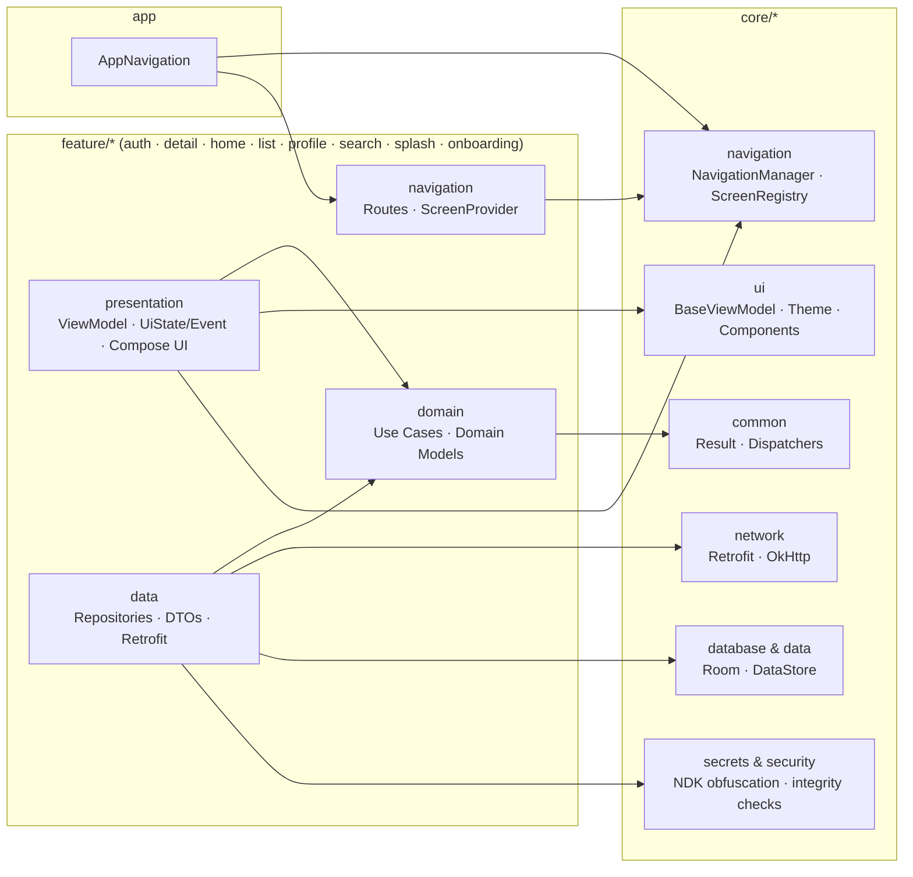

<br/>
<p align="center">
  <h1 align="center">ComposeTemplate</h1>
  <p align="center">
    A production-grade Jetpack Compose starter built on Clean Architecture, feature modularization,<br/>
    and Gradle convention plugins — with a one-command path to your own app.
    <br/>
    <br/>
    <a href="https://github.com/mustafayigitt/ComposeTemplate/issues">Report Bug</a>
    ·
    <a href="https://github.com/mustafayigitt/ComposeTemplate/issues">Request Feature</a>
  </p>
</p>

<p align="center">
  
  
  
  
</p>


```mermaid
flowchart LR
    subgraph App["app"]
        Nav["AppNavigation"]
    end

    subgraph Feature["feature/*  (auth · detail · home · list · profile · search · splash · onboarding)"]
        direction TB
        Pres["presentation\nViewModel · UiState/Event · Compose UI"]
        Dom["domain\nUse Cases · Domain Models"]
        Data["data\nRepositories · DTOs · Retrofit"]
        FNav["navigation\nRoutes · ScreenProvider"]
        Pres --> Dom
        Data --> Dom
    end

    subgraph Core["core/*"]
        direction TB
        UI["ui\nBaseViewModel · Theme · Components"]
        Navigation["navigation\nNavigationManager · ScreenRegistry"]
        Network["network\nRetrofit · OkHttp"]
        DB["database & data\nRoom · DataStore"]
        Secrets["secrets & security\nNDK obfuscation · integrity checks"]
        Common["common\nResult · Dispatchers"]
    end

    Nav --> Navigation
    Nav --> FNav
    FNav --> Navigation
    Pres --> UI
    Pres --> Navigation
    Data --> Network
    Data --> DB
    Data --> Secrets
    Dom --> Common
```

*Dependencies flow inward only: `data → domain ← presentation`, and every `feature/*` module depends on `core/*` — never the other way around.*

## About

ComposeTemplate is not a sample app — it's a template *generator*. Clone it, run one Gradle task, and get a fresh Android project with your own package name and app name, fully wired with Clean Architecture, Hilt DI, feature-based Navigation3 routing, secret hardening, static analysis, and CI, ready to build on from day one.

Everything in the repo doubles as a working reference: eight example features spanning three complexity tiers (minimal → medium → full) show exactly how much boilerplate a new screen needs, and a Kotlin Gradle plugin (`scaffoldFeature`) generates that boilerplate for you.

## Built With

| | |
|---|---|
| [Kotlin](https://kotlinlang.org/) 2.0.21 | Language |
| [Jetpack Compose](https://developer.android.com/jetpack/compose) | UI toolkit (BOM `2026.05.01`) |
| [Material 3](https://m3.material.io/) | Design system |
| [Navigation3](https://developer.android.com/jetpack/androidx/releases/navigation) | Type-safe, back-stack-driven navigation |
| [Hilt](https://developer.android.com/training/dependency-injection/hilt-android) | Dependency injection |
| [Retrofit](https://github.com/square/retrofit) + OkHttp | Networking |
| [Room](https://developer.android.com/jetpack/androidx/releases/room) + [DataStore](https://developer.android.com/topic/libraries/architecture/datastore) | Persistence |
| [Coil](https://coil-kt.github.io/coil/) | Async image loading (`AppAsyncImage` in `core:ui`) |
| [Timber](https://github.com/JakeWharton/timber) | Logging / analytics sink |
| [Macrobenchmark & Baseline Profiles](https://developer.android.com/topic/performance/baselineprofiles/overview) | Startup performance |
| [Detekt](https://detekt.dev/) + [Ktlint](https://pinterest.github.io/ktlint/) | Static analysis & formatting |
| [MockK](https://github.com/mockk/mockk) + [Truth](https://github.com/google/truth) | Testing |
| Android NDK / CMake | Native secret obfuscation |

## Architecture

Clean Architecture with unidirectional data flow, enforced at the module boundary rather than by convention. Every feature is split into four independent Gradle modules, each backed by its own convention plugin:

```
feature/{name}/
├── data/           # Repositories, DTOs, Retrofit services  → composetemplate.feature.data
├── domain/         # Use cases, domain models, repo contracts → composetemplate.feature.domain
├── navigation/     # INavigationItem routes, nav DI bindings  → composetemplate.feature.navigation
└── presentation/   # ViewModel, UiState/Event, Composables    → composetemplate.feature.presentation
```

Dependencies only point inward (`data → domain → presentation`); `core:*` modules never depend on `feature:*`. Every ViewModel extends `BaseViewModel<UiState, Event>` from `core:ui` — a single `MutableStateFlow<UiState>` plus a `Channel`-backed `Flow<Event>` for one-shot effects (navigation, snackbars).

Navigation is handled by `core:navigation`, built on **Navigation3** with `@Serializable` type-safe routes:
- `INavigationManager` exposes the back stack as a `StateFlow<List<INavigationItem>>` with `navigate`, `navigateBack`, `navigateOver`, `navigateToTop`, and tab-aware `selectTab`.
- Each feature's `presentation` module contributes an `IScreenProvider` via Hilt `@IntoSet` multibinding; `ScreenRegistry` walks the set to resolve a route to a composable.
- Bottom-bar tabs register themselves via `@IntoMap @StringKey("n")` multibindings — no central tab list to maintain.

### Example features

| Feature | Tier | Demonstrates |
|---|---|---|
| `auth` | Full | API service, token refresh (`ITokenRefresher`), tests at every layer |
| `splash` | Full | Repository-driven start-destination logic, tests at every layer |
| `profile` | Medium | DataStore-backed preferences, multiple use cases, live theme/language switching |
| `onboarding` | Medium | Pager UI, repository, pass-through use case |
| `home` / `list` / `search` | Minimal | Bottom-bar tabs, filterable lists |
| `detail` | Minimal | Parameterized route, ID extraction in `ScreenProvider` |

## Project Structure

```
ComposeTemplate/
├── app/                     # Composition root, AppNavigation
├── build-logic/             # Convention plugins (see below)
├── benchmark/                # Macrobenchmark module (StartupBenchmark)
├── baselineprofile/          # Baseline Profile generator module
├── core/
│   ├── common/               # Result<T>, dispatchers, shared contracts
│   ├── secrets/               # NDK-backed secret storage (CMake, native-lib.cpp)
│   ├── security/              # Runtime integrity: root/emulator/debugger/hook signals
│   ├── data/                  # DataStore PreferencesManager
│   ├── database/              # Room database foundation
│   ├── network/               # Retrofit/OkHttp, BaseRepository, AuthInterceptor
│   ├── navigation/             # NavigationManager, ScreenRegistry
│   ├── ui/                    # Theme, BaseViewModel, shared components
│   ├── analytics/              # IAnalyticsManager + Timber tracker
│   ├── config/                 # Remote/local config, force-update contract
│   ├── permission/             # Runtime permission helpers
│   └── google-play/            # In-app review & update
├── feature/
│   └── {auth,detail,home,list,profile,search,splash,onboarding}/
│       └── {data,domain,navigation,presentation}/
└── gradle/libs.versions.toml  # Version catalog
```

## Build System

All build configuration lives behind convention plugins in `build-logic/convention/`, so module `build.gradle.kts` files stay declarative. Full details: [`build-logic/README.md`](build-logic/README.md).

| Plugin ID | Purpose |
|---|---|
| `composetemplate.android.application` | Base app module config (SDK versions, Kotlin) |
| `composetemplate.android.application.compose` / `.android.library.compose` | Compose setup + metrics/stability reports |
| `composetemplate.android.library` | Base library module config |
| `composetemplate.android.library.native` | CMake/NDK setup for secret obfuscation |
| `composetemplate.android.hilt` | Hilt + KSP wiring |
| `composetemplate.android.room` | Room + KSP, schema export |
| `composetemplate.feature.data` / `.domain` / `.navigation` / `.presentation` | Auto-inject the correct `core:*` deps per layer |
| `composetemplate.test` | JUnit, Truth, MockK, Espresso |
| `composetemplate.static.analysis` | Centralized Detekt + Ktlint config |
| `composetemplate.baseline.profile.generator` | Baseline Profile module setup |
| `composetemplate.validate.secrets` | `validateSecrets` / `scanApkForSecrets` / `hardeningReport` tasks |
| `composetemplate.create.new.app` | `create-new-app` task (see Getting Started) |
| `composetemplate.scaffold.feature` | `scaffoldFeature` task (see Getting Started) |

## Getting Started

### Prerequisites

- Android Studio Ladybug (2024.2.1) or later
- JDK 17+ (the Gradle daemon toolchain targets JDK 21 — `foojay-resolver` provisions it automatically)
- Android SDK, API 23+ (compiles against API 37)
- Gradle 9.5.1 (bundled via the wrapper)

### 1. Clone and generate your app

```bash
git clone https://github.com/mustafayigitt/ComposeTemplate.git
cd ComposeTemplate

./gradlew create-new-app -Pargs='com.example.myapp,MyNewApp' -q --console=plain
cd ../MyNewApp
```

Run without `-Pargs` for an interactive prompt instead. The task copies the template to a sibling directory, rewrites the package name and app name across every `kt`/`kts`/`xml`/`properties` file, moves source directories to match the new package, then removes itself (`create-new-app` task, `CreateNewAppPlugin.kt`, and its plugin registration) from the generated project. `.git`, `.gradle`, `.idea`, `local.properties`, `secrets.properties`, and build outputs are never copied.

### 2. Configure secrets

Create `secrets.properties` in the generated project root:

```properties
API_KEY_DEBUG="your_debug_key"
API_KEY_RELEASE="your_release_key"
BASE_URL_DEBUG="https://api-debug.test.com/"
BASE_URL_RELEASE="https://api.test.com/"
STORE_FILE="release.keystore"
KEY_ALIAS="your_key_alias"
KEY_PASSWORD="your_key_password"
STORE_PASSWORD="your_store_password"
XOR_MASK="your_custom_mask_with_24_plus_chars"
EXPECTED_SIGNATURE_HASH="your_release_sha256_hex_with_or_without_colons"
NATIVE_RUNTIME_CHECKS_ENABLED=true
CERTIFICATE_PINNING_ENABLED=false
CERTIFICATE_PINS=""
```

```bash
./gradlew validateSecrets
```

See [`SECRET_MANAGEMENT.md`](SECRET_MANAGEMENT.md) for the full threat model and release checklist.

### 3. Scaffold a feature

```bash
./gradlew scaffoldFeature -PfeatureName=settings -PwithDatabase=true
```

Generates `feature/settings/{data,domain,navigation,presentation}` with a route, use case, `ViewModel`, `UiState`/`Event`, Compose screen, `ScreenProvider`, Hilt modules, and localized strings — then wires the new modules into `settings.gradle.kts` and `app/build.gradle.kts` automatically. Add `-PwithDatabase=true` to also scaffold a Room `Entity`/`Dao`. See [`GUIDE.md`](GUIDE.md) for the manual wiring steps and architecture conventions.

### 4. Build and verify

```bash
# CI-equivalent local checks
./gradlew ktlintCheck detekt testDebugUnitTest assembleDebug :app:assembleRelease

# Baseline profile generation (run before benchmarking)
./gradlew :baselineprofile:connectedBenchmarkAndroidTest

# Macrobenchmark
./gradlew :benchmark:connectedBenchmarkAndroidTest
```

## Key Capabilities

**Secret hardening** — API keys and base URLs can be obfuscated into native code (`composetemplate.useNativeSecrets=true`) instead of `BuildConfig`. `validateSecrets` fails the build on missing values, placeholders, weak XOR masks, or malformed URLs/signature hashes; `scanApkForSecrets` greps built APK/AAB output for raw secret leakage; `hardeningReport` summarizes release-readiness.

**Runtime integrity** — `core:security` surfaces signature, installer, emulator, debugger, root, and hook-detection signals as a `SecurityReport`, so the app can react to a compromised device at runtime.

**Compose build insights** — enable compiler metrics/stability reports via `gradle.properties`:
```properties
composetemplate.composeCompilerMetricsEnabled=true
composetemplate.composeCompilerReportsEnabled=true
```

**CI** (`.github/workflows/ci.yml`) — four jobs on every PR to `main`/`develop`: lint (`ktlintCheck` + `detekt`), unit tests, debug/release assembly, and a template smoke test that runs `scaffoldFeature` and `create-new-app` end-to-end to catch regressions in the generator itself.

## Documentation

- [`GUIDE.md`](GUIDE.md) — adding features, navigation registration, architecture conventions
- [`build-logic/README.md`](build-logic/README.md) — convention plugin internals
- [`SECRET_MANAGEMENT.md`](SECRET_MANAGEMENT.md) — secret handling threat model and release checklist
- [`AGENTS.md`](AGENTS.md) — conventions for AI coding agents working in this repo
- [`CONTRIBUTING.md`](CONTRIBUTING.md) — branching, local verification, code style
- [`SECURITY.md`](SECURITY.md) — how to report a vulnerability

## License

Licensed under the [Apache License 2.0](LICENSE).
