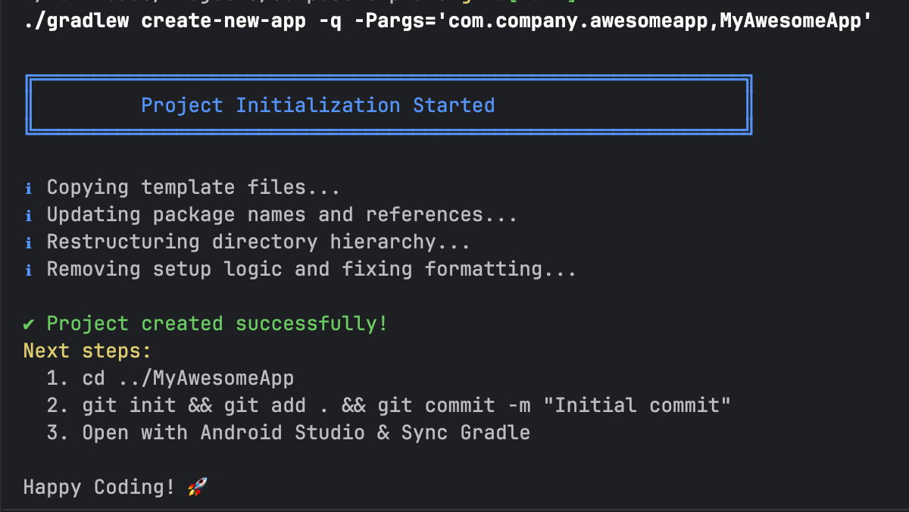

<br/>
<p align="center">
  <h3 align="center">ComposeTemplate</h3>

  <p align="center">
    ComposeTemplate is a Jetpack Compose template application that follows Clean Architecture and modularization best practices. It simplifies the process of setting up a well-structured Compose application by providing a template with a predefined folder structure. ✨
    <br/>
    <br/>
    <a href="https://github.com/mustafayigitt/ComposeTemplate/issues">Report Bug</a>
    <a href="https://github.com/mustafayigitt/ComposeTemplate/issues">Request Feature</a>
  </p>
</p>


 


## About The Project



ComposeTemplate is a Jetpack Compose template application that follows Clean Architecture and modularization best practices. It simplifies the process of setting up a well-structured Compose application by providing a template with a predefined folder structure. ✨

## Built With

| [Kotlin](https://github.com/JetBrains/kotlin) | Modern programming language for Android |
| [Modern Architecture](https://developer.android.com/topic/architecture) | UDF Architecture pattern (Clean Architecture) |
| [Jetpack Compose](https://developer.android.com/jetpack/compose) | Modern UI toolkit |
| [Material 3](https://m3.material.io/) | Material Design 3 components |
| [Navigation3](https://developer.android.com/jetpack/androidx/releases/navigation) | Type-safe navigation library |
| [Detekt](https://detekt.dev/) | Static code analysis for Kotlin |
| [Ktlint](https://pinterest.github.io/ktlint/) | Kotlin linter with built-in formatter |
| [Macrobenchmark](https://developer.android.com/topic/performance/benchmarking/macrobenchmark-overview) | Performance measurement library |
| [Baseline Profiles](https://developer.android.com/topic/performance/baselineprofiles/overview) | App startup and runtime performance optimization |
| [Retrofit](https://github.com/square/retrofit) | HTTP client for Android |
| [Hilt](https://developer.android.com/training/dependency-injection/hilt-android) | Dependency injection framework |
| [MockK](https://github.com/mockk/mockk) | Mocking library for Kotlin |
| [Truth](https://github.com/google/truth) | Fluent assertions for Java and Android |

## Project Structure

The project follows Clean Architecture principles with clear separation of concerns and uses Convention Plugins for build configuration. The project is also modularized by feature.

```
ComposeTemplate/
├── app/                    # Main application module
├── baselineprofile/        # Baseline Profile generator module
├── benchmark/              # Macrobenchmark module
├── build-logic/            # Convention plugins
│   └── convention/
│       └── src/main/kotlin/.../convention/
│           ├── AndroidApplicationConventionPlugin.kt
│           ├── BaselineProfileGeneratorConventionPlugin.kt
│           ├── AndroidComposeConventionPlugin.kt
│           ├── AndroidHiltConventionPlugin.kt
│           ├── AndroidLibraryConventionPlugin.kt
│           ├── AndroidLibraryNativeConventionPlugin.kt
│           ├── FeatureDataConventionPlugin.kt
│           ├── FeatureDomainConventionPlugin.kt
│           ├── FeatureNavigationConventionPlugin.kt
│           ├── FeaturePresentationConventionPlugin.kt
│           ├── StaticAnalysisConventionPlugin.kt
│           ├── TestConventionPlugin.kt
│           ├── ValidateSecretsPlugin.kt
│           ├── ScaffoldFeaturePlugin.kt
│           ├── CreateNewAppPlugin.kt
│           └── ProjectExtensions.kt
├── core/
│   ├── analytics/          # Analytics contracts and Timber tracker
│   ├── common/             # Shared utilities (Result, Dispatchers)
│   ├── config/             # Local config and force-update contract
│   ├── data/               # DataStore-based PreferencesManager
│   ├── database/           # Room database foundation
│   ├── google-play/        # In-app review and update helpers
│   ├── navigation/         # NavigationManager, ScreenRegistry
│   ├── network/            # Retrofit, OkHttp, BaseRepository
│   ├── permission/         # Runtime permission helpers
│   ├── secrets/            # Secret management and native obfuscation
│   ├── security/           # Runtime integrity and hardening signals
│   └── ui/                 # Theme, BaseViewModel, shared components
├── feature/
│   ├── auth/               # Login flow and token refresh example
│   ├── detail/             # Typed route argument example
│   ├── home/               # Home tab (bottom bar)
│   ├── list/               # List tab (bottom bar)
│   ├── profile/            # Profile tab (bottom bar)
│   ├── search/             # Search tab (bottom bar)
│   └── splash/             # Splash + start destination
│   └── {feature}/
│       ├── data/           # Repository, DTOs, API services
│       ├── domain/         # Use cases, domain models
│       ├── navigation/     # Routes, DI modules
│       └── presentation/   # ViewModels, Composables
└── gradle/
    └── libs.versions.toml  # Version catalog
```

## Configuration Files

- **`gradle.properties`**: Project-wide Gradle settings, including Compose Metrics toggles.
- **`secrets.properties`**: API keys, Base URLs, and signing credentials (git-ignored).
- **`local.properties`**: Machine-specific paths like SDK location (git-ignored).

## Build Configuration

This project uses modern Gradle build configuration with **Convention Plugins** and **Version Catalog** for maintainable and scalable build logic.

### Convention Plugins

Located in `build-logic/convention/`, these plugins encapsulate common build configuration:

- **`composetemplate.android.application`**: Base Android app configuration (SDK versions, Kotlin setup)
- **`composetemplate.android.application.compose`**: Jetpack Compose setup with metrics and stability reports support
- **`composetemplate.android.hilt`**: Hilt dependency injection configuration
- **`composetemplate.android.library`**: Android library module configuration
- **`composetemplate.android.library.compose`**: Compose setup for Android library modules
- **`composetemplate.android.room`**: Room and KSP setup with schema export support
- **`composetemplate.test`**: Common testing dependencies (JUnit, Truth, MockK, Espresso)
- **`composetemplate.feature.domain`**: Domain module dependencies (`:core:common`) and test/Hilt setup
- **`composetemplate.feature.data`**: Data module dependencies (`:core:common`, `:core:data`, `:core:database`, `:core:network`, `:core:secrets`)
- **`composetemplate.feature.navigation`**: Navigation module dependencies (`:core:common`, `:core:navigation`, Compose icons)
- **`composetemplate.feature.presentation`**: Presentation module dependencies (`:core:common`, `:core:ui`, `:core:navigation`, Compose, Hilt, test setup)
- **`composetemplate.android.library.native`**: CMake/NDK native library support for secret obfuscation
- **`composetemplate.validate.secrets`**: Validates `secrets.properties` presence and content
- **`composetemplate.scaffold.feature`**: Auto-generates a new feature module with all 4 sub-modules
- **`composetemplate.create.new.app`**: Creates a new app from this template with custom package name
- **`composetemplate.static.analysis`**: Centralized Detekt and Ktlint configuration for all modules
- **`composetemplate.baseline.profile.generator`**: Baseline Profile generator module setup

### Version Catalog

All dependencies and versions are managed in `gradle/libs.versions.toml`.

For detailed build configuration documentation, see [build-logic/README.md](build-logic/README.md).

## Key Features

### Compose Metrics & Stability Reports
- Generate detailed reports on composable functions (restartable, skippable).
- Enable via `gradle.properties`:
  ```properties
  composetemplate.composeCompilerMetricsEnabled=true
  composetemplate.composeCompilerReportsEnabled=true
  ```

### Benchmarking
- Dedicated `:benchmark` module using Jetpack Macrobenchmark.
- Includes `StartupBenchmark` to measure app launch performance with baseline profiles applied.
- Run benchmarks after generating profiles: `./gradlew :benchmark:connectedBenchmarkAndroidTest`.
- ⚠ Baseline profiles must be generated before running benchmarks (`BaselineProfileMode.Require`).

### Baseline Profiles
- Dedicated `:baselineprofile` module using `BaselineProfileRule`.
- Generates startup and critical user journey profiles for AOT compilation.
- Profiles are automatically packaged into release builds via the `androidx.baselineprofile` Gradle plugin.
- Run profile generation: `./gradlew :baselineprofile:connectedBenchmarkAndroidTest`.

### Secret Management
- **NDK Secret Obfuscation**: API keys and base URLs are obfuscated in native code when `composetemplate.useNativeSecrets=true`.
- **Build-Time Validation**: `validateSecrets` blocks missing values, placeholders, weak masks, invalid signature hashes, and invalid Retrofit base URLs.
- **Runtime Integrity Checks**: `:core:security` reports signature, package, installer, emulator, debugger, root, and hooking signals.
- **MITM Protection**: Release builds use cleartext-off network config and optional OkHttp certificate pinning.
- **Artifact Scanning**: `scanApkForSecrets` checks APK/AAB outputs for raw configured secrets.

### Static Analysis
- **Detekt Integration**: Custom rule sets optimized for Android, Compose, and Hilt.
- **Ktlint Integration**: Automated Kotlin linting and formatting.

### Navigation System
- **Navigation3 Integration**: Uses the latest Navigation3 library with type-safe navigation.
- **Custom NavigationManager**: Flexible navigation management with back stack handling.

### Network Layer
- **Retrofit Integration**: Configured with Gson converter.
- **BaseRepository**: Safe API call wrapper returning `Result<T>` (Success/Error/Loading).

## Getting Started

### Prerequisites

- Android Studio Ladybug (2024.2.1) or later
- JDK 17 or later
- Android SDK with API level 23 (Android 6.0) or higher
- Gradle 9.5.1 or later

### Installation

1. **Clone the repository**

```sh
git clone https://github.com/mustafayigitt/ComposeTemplate.git
cd ComposeTemplate
```

2. **Create a new app from the template**

```bash
./gradlew create-new-app -Pargs='com.example.myapp,MyNewApp' -q --console=plain
cd ../MyNewApp
```

The initializer rewrites package/application identifiers and intentionally does not copy `local.properties`, `secrets.properties`, `.git`, or build outputs.

3. **Configure local secrets in the generated app**

Create a `secrets.properties` in the generated app root:

```properties
API_KEY_DEBUG="your_debug_key"
API_KEY_RELEASE="your_release_key"
BASE_URL_DEBUG="https://api-debug.test.com/"
BASE_URL_RELEASE="https://api.test.com/"
STORE_FILE="release.keystore"
KEY_ALIAS="your_key_alias"
KEY_PASSWORD="your_key_password"
STORE_PASSWORD="your_store_password"
XOR_MASK="your_custom_mask_with_24_plus_chars"
EXPECTED_SIGNATURE_HASH="your_release_sha256_hex_with_or_without_colons"
NATIVE_RUNTIME_CHECKS_ENABLED=true
CERTIFICATE_PINNING_ENABLED=false
CERTIFICATE_PINS=""
```

See `SECRET_MANAGEMENT.md` for the threat model and release checklist.

Use `./gradlew validateSecrets` to verify the file before building.

### Feature Scaffolding

To add a new feature with all 4 layers (data, domain, navigation, presentation) automatically:

```bash
./gradlew scaffoldFeature -PfeatureName=settings
```
This will create the modules, add them to `settings.gradle.kts`, and inject them as dependencies in `:app`.

For more details, see [GUIDE.md](GUIDE.md).

### Architecture

This project follows **Clean Architecture** principles:

- **Data Layer**: API services, Repositories, Data Models.
- **Domain Layer**: Use Cases, Domain Models, Repository Interfaces.
- **Presentation Layer**: ViewModels, UI States, Composable Screens.
- **Core Layer**: Shared utilities, Native layer, Base classes.

## Testing

```sh
# CI-equivalent local checks
./gradlew ktlintCheck detekt testDebugUnitTest assembleDebug :app:assembleRelease

# Macrobenchmark
./gradlew :benchmark:connectedBenchmarkAndroidTest

# Baseline Profile generation
./gradlew :baselineprofile:connectedCheck
```

## License

This project is licensed under the Apache License 2.0 - see the [LICENSE](LICENSE) file for details.
